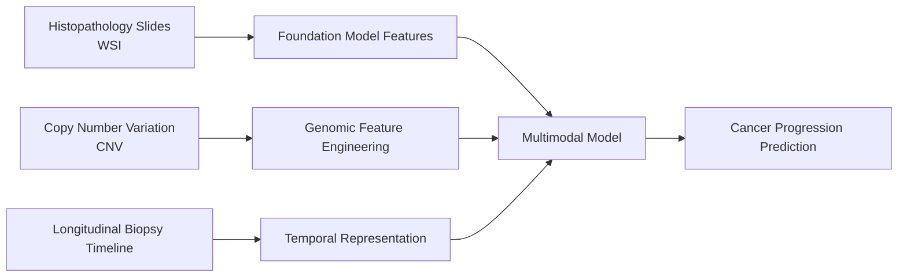
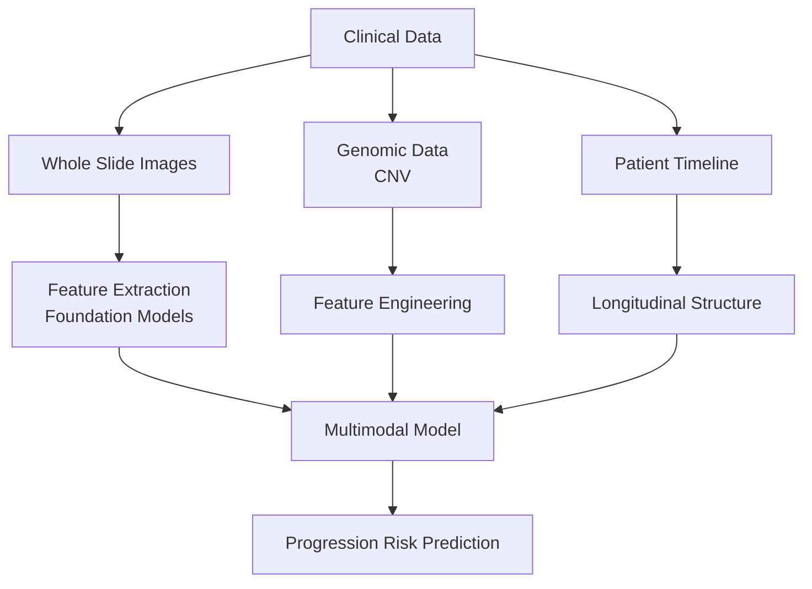

# Multimodal AI for Early Cancer Progression Detection

AI system for combining pathology, genomics, and longitudinal biopsy history to estimate cancer progression risk earlier.

## Why This Matters

- Oesophageal cancer still has very poor outcomes once it becomes invasive.
- In U.S. SEER data, only `21.9%` of patients survive `5` years or more after diagnosis, meaning about `4 in 5` do not.
- A major review in *Nature Reviews Gastroenterology & Hepatology* notes that overall `5-year` survival for oesophageal cancer remains `<20%` because many patients are diagnosed late.

References:

- [NCI SEER Cancer Stat Facts: Esophageal Cancer](https://seer.cancer.gov/statfacts/html/esoph.html)
- [Thrift AP. Global burden and epidemiology of Barrett oesophagus and oesophageal cancer. Nature Reviews Gastroenterology & Hepatology (2021)](https://www.nature.com/articles/s41575-021-00419-3)
- [American Cancer Society: Key Statistics for Esophageal Cancer](https://www.cancer.org/cancer/types/esophagus-cancer/key-statistics.html)

## Problem

- Hospitals generate large volumes of histopathology images.
- They also generate genomic copy number variation (CNV) data.
- Patients have longitudinal biopsy timelines across surveillance visits.
- These signals are rarely integrated for early cancer progression detection.

## Multimodal Data Sources



## System Architecture



## Experiment Framework

- Train multiple model variants.
- Test different feature sets and modality combinations.
- Track experiments reproducibly.
- Compare performance across model families and tasks.

## Terminal Usage

```bash
git clone https://github.com/rzuberi/multimodal-barretts-progression
cd multimodal-barretts-progression

python train_model.py --config configs/example.yaml
```

- Runs headless training.
- Supports custom datasets.
- Allows testing new models and feature pipelines.

## Goal

- Detect cancer progression earlier.
- Integrate multimodal clinical data.
- Build reusable research infrastructure.
