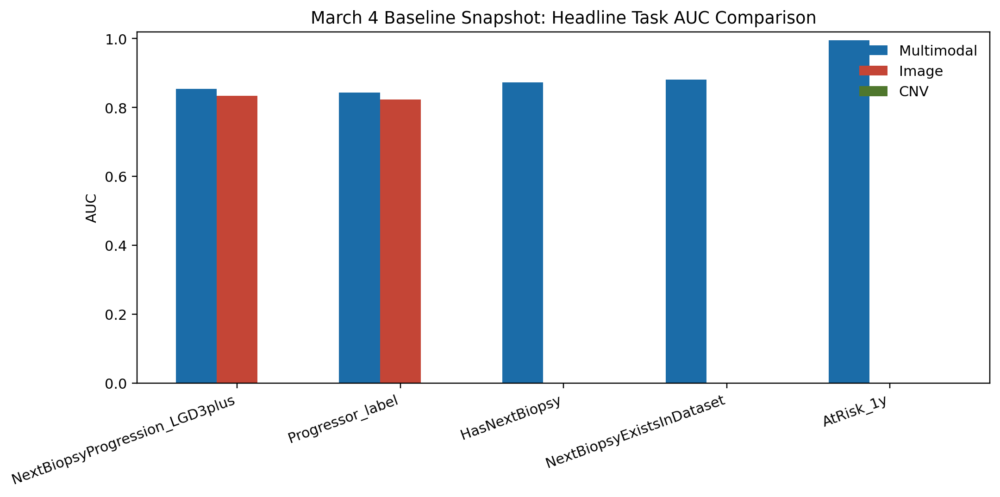
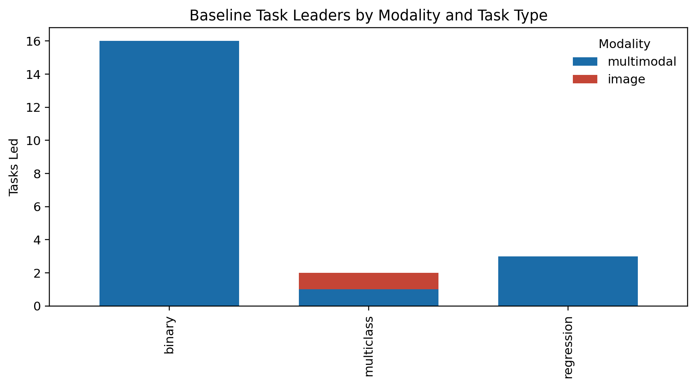
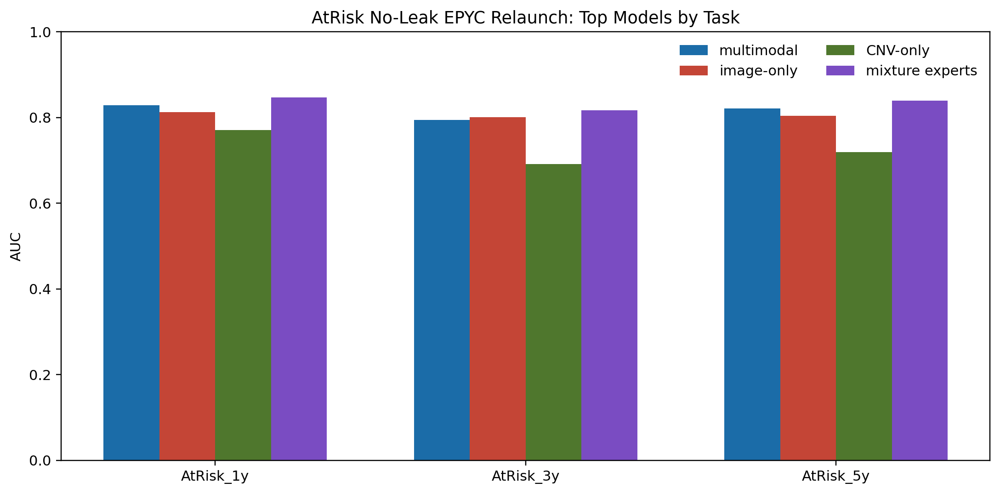
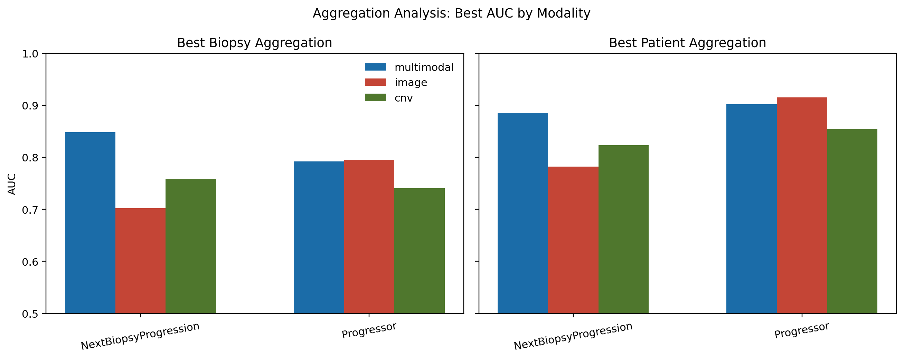
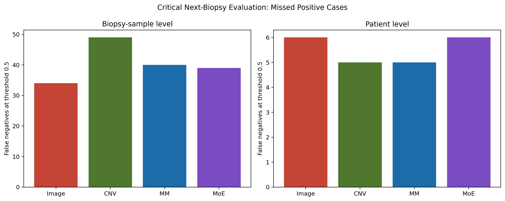
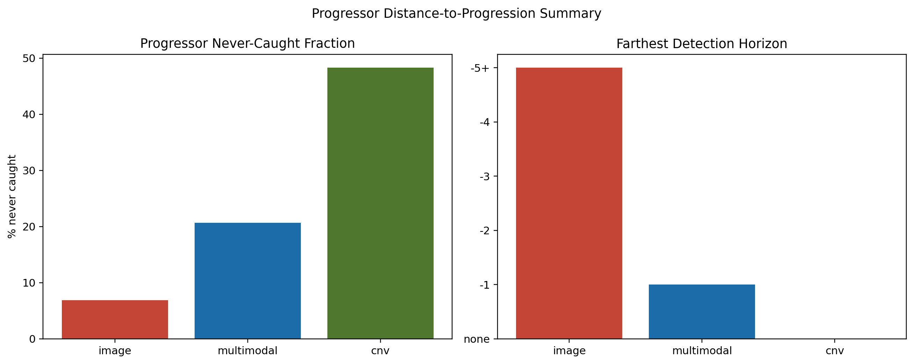
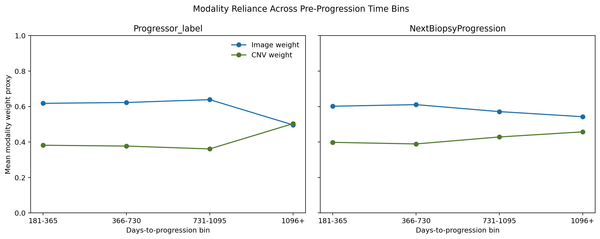

# Multimodal Barrett's Progression

Aggregate-only public snapshot of a Barrett's oesophagus modelling programme spanning histopathology image models, CNV models, trainable multimodal models, and derived mixture-of-experts analyses.

## Abstract

This repository is a privacy-preserving research summary for one question: when Barrett's surveillance biopsies are represented with histopathology foundation features and copy-number features, where does multimodality help, where does it fail, and how sensitive are the conclusions to cohort definition, aggregation strategy, and time-to-progression framing? The public material is limited to aggregate summaries, figures, and de-identified report tables. No patient identifiers, no row-level predictions, no slide embeddings, and no derived master tables are included.

## Problem Statement

The core programme asks whether multimodal models improve prediction of progression-related Barrett's endpoints over unimodal baselines under a fixed, patient-disjoint cross-validation protocol. The repo focuses on the parts of the experimental programme that best explain the main scientific story:

- no-leak AtRisk benchmarks
- critical next-biopsy progression framing
- biopsy-to-patient aggregation choices
- distance-to-progression behaviour
- multimodal rescue or hurt patterns
- time-varying modality reliance

## Privacy Boundary

Included:

- aggregate leaderboard tables
- campaign-level summary CSVs
- de-identified report summaries
- static figures and narrative interpretation

Excluded:

- patient or sample identifiers
- row-level predictions
- master cohort tables and derived labels at row level
- trajectory files, detail tables, or any file that could re-identify cases

This means the repo is reproducible at the aggregate-report layer, not at the private data reconstruction layer.

## Methods

### Baseline study design

- Canonical progression endpoint: `NextBiopsyProgression_LGD3plus`
- Locked policy: `rep=1`, `folds=1..5`, patient-disjoint folds
- Conditions: `all_samples`, `exclude_hgd_imc`, `exclude_lgd_hgd_imc`
- Modalities: image, CNV, multimodal
- Public baseline snapshot files live in [data_snapshots](data_snapshots)

### Main experiment families

- canonical LGD3plus progression benchmarking
- AtRisk no-leak analysis across unimodal, multimodal, and MoE methods
- critical next-biopsy evaluation at biopsy-sample and patient level
- biopsy-to-patient aggregation analysis for `Progressor_label` and `NextBiopsyProgression_LGD3plus`
- distance-to-progression and never-caught analysis
- modality-weight versus time-to-progression analysis

### Method updates carried into the narrative

- Next-biopsy task derivation and canonical LGD3plus handling were tightened during method refinement
- Multimodal time-covariate variants were added for next-biopsy prediction
- Routing and combo-fusion wiring fixes were applied before the downstream analyses were generated
- Patient-aware reporting replaced ambiguous sample-level language where needed

Implementation inventories remain in:

- [METHODS_IMPLEMENTED.md](METHODS_IMPLEMENTED.md)
- [MODEL_ARCHITECTURES.md](MODEL_ARCHITECTURES.md)
- [THREAT_MODEL_AND_FAILURE_MODES.md](THREAT_MODEL_AND_FAILURE_MODES.md)

## Results

### 1) Core progression snapshot

The original public snapshot still anchors the repo:

- stable aggregate coverage: `315` rows, `304` complete
- task leaders: `20/21` tasks led by multimodal models, `1/21` by image
- canonical progression headline: multimodal AUC `0.854` vs image `0.834` in the stored headline snapshot




Key baseline files:

- [data_snapshots/headline_task_auc_comparison.csv](data_snapshots/headline_task_auc_comparison.csv)
- [data_snapshots/task_leaders.csv](data_snapshots/task_leaders.csv)
- [data_snapshots/model_leaderboard_binary_auc.csv](data_snapshots/model_leaderboard_binary_auc.csv)

### 2) AtRisk no-leak benchmark

The strongest no-leak benchmark result in the public repo comes from the AtRisk relaunch analysis:

- `AtRisk_1y`: best MoE AUC `0.8468`, above top multimodal `0.8290`, image `0.8121`, and CNV `0.7712`
- `AtRisk_3y`: best MoE AUC `0.8168`
- `AtRisk_5y`: best MoE AUC `0.8391`

This matters because the strongest gains came from derived expert combinations rather than a uniform win from a single trainable multimodal architecture.



Source table: [data_snapshots/atrisk_noleak_headline_models.csv](data_snapshots/atrisk_noleak_headline_models.csv)

### 3) Aggregation changes the apparent winner

The aggregation study showed that the preferred modality depends on both endpoint and unit of analysis:

- `NextBiopsyProgression_LGD3plus`: multimodal was strongest at both biopsy level (`AUC 0.848`) and patient level (`AUC 0.886`)
- `Progressor_label`: image slightly beat multimodal at both biopsy level (`0.795` vs `0.792`) and patient level (`0.915` vs `0.902`)

So the repo does not support a simple claim that multimodal wins everywhere. A narrower reading fits the evidence better: multimodal is strongest for some clinically central next-biopsy formulations, while other endpoints remain image-led after aggregation.



Source table: [data_snapshots/biopsy_patient_aggregation_best.csv](data_snapshots/biopsy_patient_aggregation_best.csv)

### 4) Critical next-biopsy evaluation is less flattering than leaderboard AUC alone

For the critical next-biopsy framing, sample-level AUCs were modest and patient-level AUCs were lower still:

- biopsy-sample level: image `0.686`, CNV `0.591`, multimodal `0.646`, MoE `0.681`
- patient level: image `0.560`, CNV `0.557`, multimodal `0.582`, MoE `0.601`

This is important because it shows that a model family can look strong in broad leaderboard tables and still provide only moderate discrimination in a clinically narrower progression framing.



Source table: [data_snapshots/critical_biopsy_headline.csv](data_snapshots/critical_biopsy_headline.csv)

### 5) Earlier detection and lower miss rates are not the same thing

The distance-to-progression study found a split pattern on `Progressor_label`:

- image reached the farthest detection horizon (`-5+`)
- multimodal had the strongest overall progression AUC in the originating campaign family
- CNV had the worst never-caught fraction (`48.3%`)
- multimodal reduced that never-caught fraction to `20.7%`
- image had the smallest never-caught fraction (`6.9%`)

The conclusion is not “multimodal dominates”, but rather that the different modalities appear to encode different surveillance-useful signals.



Source table: [data_snapshots/distance_to_progression_summary.csv](data_snapshots/distance_to_progression_summary.csv)

### 6) Modality reliance appears to shift nearer progression

Using branch-ablation dependence as a modality-weight proxy:

- `Progressor_label` showed a negative correlation between days-to-progression and image weight (`rho=-0.2069`, `p=0.0491`)
- `NextBiopsyProgression_LGD3plus` showed a smaller, non-significant trend (`rho=-0.0442`)

Interpretation: for the progressor framing, image dependence appears to increase nearer progression while far-from-progression biopsies remain more CNV-balanced.



Source tables:

- [data_snapshots/modality_weight_shift_summary.csv](data_snapshots/modality_weight_shift_summary.csv)
- [data_snapshots/modality_weight_time_bins.csv](data_snapshots/modality_weight_time_bins.csv)

## Discussion

Three high-level conclusions fit the current public evidence:

1. Multimodality is genuinely competitive and often best on canonical next-biopsy progression tasks.
2. The broader analysis set weakens any claim that multimodality is uniformly superior across every endpoint or analysis unit.
3. Derived mixture-of-experts and aggregation policy matter enough that they belong in the main scientific story, not as appendix-only details.

The repo is therefore meant to read less like a leaderboard dump and more like a compact aggregate-only paper record: baseline study, follow-on analyses, contradictory findings, and a documented privacy boundary.

## Limitations

- The public repo is still aggregate-only and cannot reproduce training from private source data.
- Some analyses remain represented only by derived aggregate tables, not full public pipelines.
- External validation, calibration work, subgroup robustness, and prospective evaluation remain open gaps.
- Several potentially interesting internal reports were intentionally excluded because they contained patient-level or trajectory-level material.

## Reproducibility

Install the minimal dependencies and rebuild the public snapshot:

```bash
pip install -r requirements.txt
python3 scripts/build_public_snapshot.py
```

This regenerates the derived public tables in [data_snapshots](data_snapshots) and the static figures in [figures](figures) from the checked-in aggregate sources in [source_aggregates](source_aggregates).

## Provenance And Navigation

- Snapshot provenance and exclusion rules: [SNAPSHOT_PROVENANCE.md](SNAPSHOT_PROVENANCE.md)
- Baseline results summary: [RESULTS_SUMMARY.md](RESULTS_SUMMARY.md)
- Aggregate source inputs used by the rebuild script: [source_aggregates](source_aggregates)
