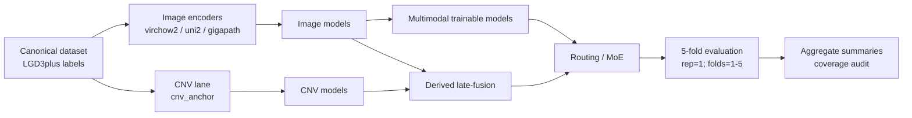

# Multimodal Barrett's Progression

Aggregate-only research snapshot for Barrett's multimodal histopathology + CNV modeling.

## Research question
Can multimodal models (image + CNV) improve prediction performance over image-only and CNV-only baselines for progression-related Barrett's endpoints under a fixed protocol (`rep=1`, `folds=1..5`, canonical LGD3plus labels, and condition-stratified evaluation)? This is falsifiable: if multimodal AUC does not exceed unimodal AUC on the same task/condition snapshot, the hypothesis is not supported for that setting.

## What’s in this repo / what’s not

### Included
- Aggregate experiment snapshots and leaderboards
- Model architecture and method inventories
- Campaign-level coverage/queue metadata
- Documentation of evaluation policy, assumptions, and failure modes

### Excluded
- Patient/sample identifiers
- Slide-level embeddings, tiles, or raw feature matrices
- Row-level predictions tied to individual records
- PHI or re-identification surfaces

## Experimental design at a glance

```text
Derived cohort (canonical LGD3plus labeling)
    -> Encoder lanes
       - image: virchow2 | uni2 | gigapath
       - cnv:   cnv_anchor
    -> Model families
       - image MIL
       - cnv tabular
       - multimodal trainable
       - derived late-fusion / routing / combo-fusion
    -> Tasks (binary + multiclass + regression)
    -> CV policy: rep=1, folds=1..5, patient-disjoint folds
    -> Metrics
       - binary: AUC, sensitivity, specificity (+ operating-point metrics when available)
       - multiclass: macro AUC OVR, macro F1, accuracy
       - regression: MAE, MSE, R2
    -> Aggregate summaries + coverage audit
```

### One-slide view (modalities, fusion, evaluation loop)



## Key findings (snapshot)

- In this snapshot, stable aggregate coverage includes `315` rows, with `304` complete and `11` incomplete (`data_snapshots/coverage_status.csv`).
- The full-coverage campaign plan reports `864` runlist rows with `402` trainable rows, `462` derived late-fusion rows, and `0` blocked rows (same snapshot file).
- For `NextBiopsyProgression_LGD3plus` (canonical progression), best observed multimodal AUC is `0.854` vs best image-only `0.834` (both from `exclude_lgd_hgd_imc`, top-50 binary leaderboard snapshot).
- For `Progressor_label` (`all_samples`), best observed multimodal AUC is `0.843` vs best image-only `0.823` in this snapshot.
- In the top-50 binary leaderboard snapshot, modality composition is highly multimodal-heavy (`47/50` multimodal, `3/50` image, `0/50` CNV), so CNV-only headline AUCs are often `NA` in that specific table.
- Task leaders are mostly multimodal in this snapshot (`20/21` tasks), with one image-led task (`NextBiopsyTier3`) in `task_leaders.csv`.
- Many highest AUC rows for risk/progression-oriented binary tasks appear under exclusion conditions (especially `exclude_lgd_hgd_imc`), suggesting condition sensitivity that warrants careful interpretation.

All findings above are preliminary and specific to this stored aggregate snapshot; they are not claims of external clinical performance.

## Limitations & failure modes

- Spurious correlation risk from acquisition/site artifacts may inflate fold-level performance.
- Cohort shift risk: deployment distributions may differ from snapshot training/evaluation conditions.
- Leakage controls are fold-based and patient-disjoint, but external leakage channels are not fully stress-tested here.
- Calibration is not yet a deployment-grade focus in this public snapshot (decision thresholds can drift).
- Class imbalance can produce unstable sensitivity/specificity tradeoffs across conditions.
- Missing labels/censoring can bias endpoint prevalence and observed metrics.
- Shortcut learning risk remains (non-causal cues in images or CNV proxies).
- Multimodal collapse risk: one modality can dominate while the other contributes little.
- Overfitting-to-folds risk remains without external prospective validation.
- Snapshot leaderboard is truncated (top-50 binary rows), so absence of a modality in that table is not proof of total absence in all runs.

## Reproducibility

### Reproducible from this repo
- Aggregate results inspection
- Model/method inventory auditing
- Snapshot-level comparisons and narrative claims linked to `data_snapshots/*`

### Requires internal PHI environment
- Regenerating derived labels from source clinical data
- End-to-end training/inference execution from raw data
- Any per-patient or per-sample analysis

## How to navigate

- Architectures: [MODEL_ARCHITECTURES.md](MODEL_ARCHITECTURES.md)
- Methods: [METHODS_IMPLEMENTED.md](METHODS_IMPLEMENTED.md)
- Results summary (paper-style): [RESULTS_SUMMARY.md](RESULTS_SUMMARY.md)
- Threat model / failure modes: [THREAT_MODEL_AND_FAILURE_MODES.md](THREAT_MODEL_AND_FAILURE_MODES.md)
- Snapshot files:
  - [data_snapshots/coverage_status.csv](data_snapshots/coverage_status.csv)
  - [data_snapshots/model_leaderboard_binary_auc.csv](data_snapshots/model_leaderboard_binary_auc.csv)
  - [data_snapshots/task_leaders.csv](data_snapshots/task_leaders.csv)
  - [data_snapshots/model_architecture_inventory.csv](data_snapshots/model_architecture_inventory.csv)
  - [data_snapshots/methods_inventory.csv](data_snapshots/methods_inventory.csv)
  - [data_snapshots/headline_task_auc_comparison.csv](data_snapshots/headline_task_auc_comparison.csv)

## Author / context

Maintained by `rzuberi` as a public, privacy-preserving research showcase of the Barrett's multimodal progression modeling program.

## Why this matters

Clinical ML systems can look strong in narrow evaluations yet fail under shift, confounding, or threshold instability. A transparent aggregate-only record of tasks, methods, and failure-mode-aware evaluation is a practical step toward safer, testable claims before any high-stakes deployment discussion.

## Canonical policy reminders

- Canonical progression endpoint is `NextBiopsyProgression_LGD3plus`.
- `NextBiopsyProgression` is deprecated/stale in this project context.
- CV policy is fixed to `rep=1`, `folds=1..5` for this campaign family.
